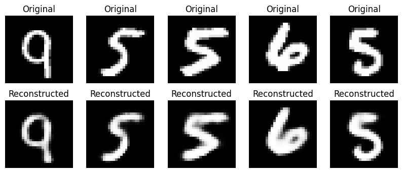
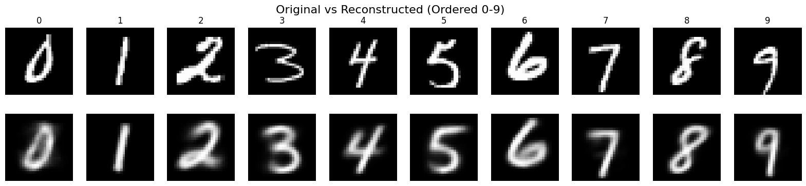
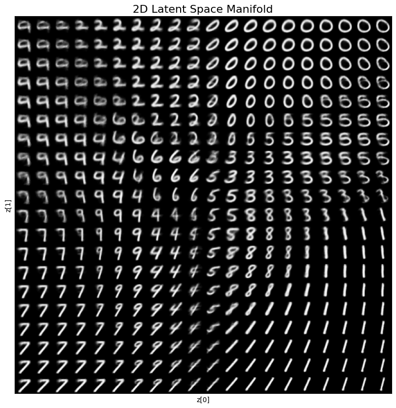
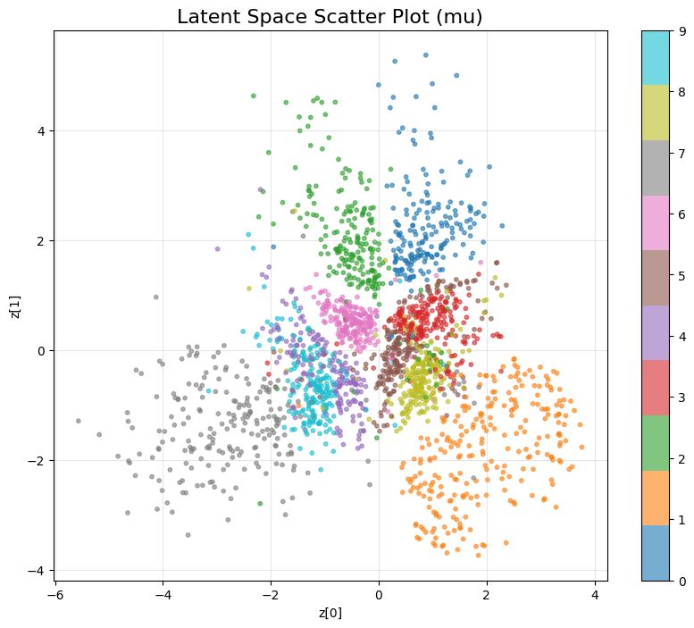
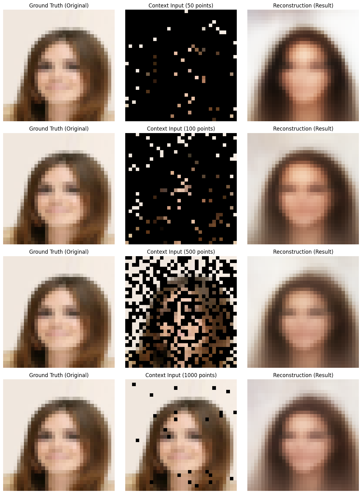

# VAE & Neural Processes Study

This repository contains implementations of deep generative models including Autoencoders, Variational Autoencoders (VAE), and Neural Processes using PyTorch. The experiments are conducted on MNIST and CelebA datasets.
- [Auto-Encoding Variational Bayes](https://arxiv.org/pdf/1312.6114)
- [Neural Processes](https://arxiv.org/pdf/1807.01622)

## Project Structure

- `autoencoder.ipynb`: Implementation of a standard Autoencoder.
- `vae.ipynb`: Implementation of a Variational Autoencoder (VAE) with latent space visualization.
- `neuralprocesses.ipynb`: Implementation of Neural Processes for image inpainting.

## 1. Autoencoder

A simple Autoencoder trained on the MNIST dataset. It compresses 28x28 images into a lower-dimensional latent representation and reconstructs them.



## 2. Variational Autoencoder (VAE)

A VAE trained on MNIST, learning a continuous latent space.

### Reconstruction Results
Comparison between original MNIST digits and their VAE reconstructions.


### Latent Space Manifold
Visualization of the learned 2D latent manifold, showing smooth transitions between digits.


### Latent Space Distribution
Scatter plot of the latent space (mu) colored by digit classes.


## 3. Neural Processes

Neural Processes (NP) implementation applied to the CelebA dataset for image inpainting tasks. The model learns to reconstruct images given a context of partial pixel observations.



## Getting Started

1. Install dependencies:
   ```bash
   pip install torch torchvision matplotlib numpy
   ```

2. Run the notebooks:
   - Start `autoencoder.ipynb` for basic AE experiments.
   - Start `vae.ipynb` to explore VAEs and latent space generation.
   - Start `neuralprocesses.ipynb` for Neural Process experiments (requires CelebA dataset).
